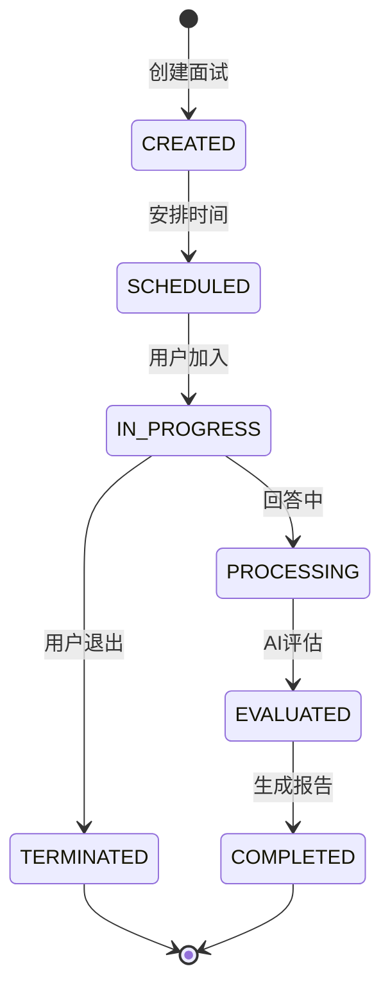

# AI模拟面试系统

## 第一章：系统架构设计

### 1.1 分层架构设计

```markdown
表示层 (Vue 3)
   ↓
应用层 (Spring Boot 3)
   ↓              ↓
业务层          AI服务层 (Spring AI)
   ↓              ↓
数据访问层       基础设施层
   ↓              ↓
数据库          第三方服务
```

---

### 1.2 微服务模块划分

1. **认证服务**：Spring Security + JWT
2. **简历服务**：简历解析、存储与分析
3. **面试服务**：AI面试流程管理
4. **岗位服务**：职位管理与匹配分析
5. **报告服务**：评估报告生成
6. **系统服务**：RBAC权限管理
7. **AI网关**：统一AI服务调用

---

### 1.3 用户角色功能

|    角色    |                           核心功能                           |
| :--------: | :----------------------------------------------------------: |
| **求职者** | 简历上传/解析、AI模拟面试、面试报告查看、面试历史、岗位匹配分析、面试排期 |
| **企业HR** | 候选人管理、面试题库配置、面试任务发布、面试过程监控、评估报告生成、人才库管理 |
| **管理员** | 用户管理、权限分配、敏感词过滤、AI模型配置、数据统计、系统监控 |

---

### 1.4 系统功能模块

```markdown
1. 认证中心
   - RBAC权限管理
   - 三方登录集成
   - JWT令牌管理

2. 智能简历模块
   - 简历解析（PDF/Word解析）
   - 关键信息提取
   - 简历评分系统
   - 简历格式转换

3. AI模拟面试核心
   - 面试场景选择（技术/行为/压力测试）
   - 实时音视频交互
   - AI面试官问答引擎
   - 表情/情绪分析反馈
   - 答案语义分析
   - 面试异常检测

4. 报告分析系统
   - 多维能力雷达图
   - 岗位匹配度评分
   - 能力缺陷分析
   - 改进建议生成

5. HR管理后台
   - 候选人筛选漏斗
   - 面试评估标注
   - 人才标签系统
   - 面试排期日历

6. 题库管理中心(优先级靠后)
   - 行业题库分类
   - 企业自定义题库
   - 智能问题推荐
   - 题目难度分级

7. 系统管理
   - 敏感词过滤规则
   - AI参数配置
   - 操作日志审计
   - 服务状态监控
```

---

## 第二章：技术栈实现方案

### 2.1 核心组件技术选型

|     模块     |              技术实现              |      特别说明       |
| :----------: | :--------------------------------: | :-----------------: |
| **前端框架** |    `Vue 3 + Pinia + Element Plus`    | 采用Composition API |
| **后端框架** |  `Spring Boot 3.4.6 + Spring AI 1.2 + Mybatis + Elasticsearch`  |     Java 17基础     |
| **编译构建** |      `JDK17 + maven3.9.9`      |    兼容     |
| **权限控制** |      `Spring Security 6 + JWT`      |    OAuth2.0兼容     |
|  **AI集成**  | `Spring AI (OpenAI/Azure/Stability)/国内大模型（讯飞星火等）` |     多模型支持      |
|  **音视频**  |       `Agora/腾讯云TRTC + WebRTC + FFmpeg（录制转码）`       |    云端录制服务     |
|  **数据库**  |     `MySQL 8 + Redis 7 + MinIO(文件存储)`     |    多级存储体系     |
| **异步处理** |   `RabbitMQ + Spring Cloud Stream`   |    消息驱动架构     |
|   **监控**   |     `Prometheus + Grafana + ELK`     |    全链路可观测     |
| **部署** | `Docker + Kubernetes + Jenkins（CI/CD） + Nginx` | 云原生 |

---

## 第三章：详细功能模块实现方案

### 3.1 认证与权限模块（已完成）

**技术增强：**

- Spring Security OAuth2 Resource Server
- JWT令牌自动续期
- 双因素认证（邮件/短信）

---

**核心实现类：**

|                         全类名                          |                             说明                             |
| :-----------------------------------------------------: | :----------------------------------------------------------: |
|       `cn.minglg.interview.config.SecurityConfig`       |                自定义`Spring Security`配置类                 |
| `cn.minglg.interview.filter.CustomAuthenticationFilter` | 自定义用户名密码过滤器，替换框架默认的`UsernamePasswordAuthenticationFilter` |
|       `cn.minglg.interview.filter.JwtTokenFilter`       |                        JWT验证过滤器                         |

---

### 3.2 简历智能分析模块

**AI集成流程：**

```markdown
简历上传 → MinIO存储 → 异步解析队列 → 
Spring AI处理 → 提取结构化数据 → 
生成评分报告 → 存入数据库
```

---

### 3.3 AI模拟面试引擎

**面试生命周期状态机：**




---

### 3.4 岗位智能匹配模块

---

### 3.5 综合评估报告系统

**报告结构：**

```json
{
  "overallScore": 85,
  "radarChart": {
    "technicalSkills": 90,
    "communication": 75,
    "problemSolving": 85,
    "cultureFit": 80,
    "experienceMatch": 90
  },
  "sectionScores": [
    {"section": "技术知识", "score": 88},
    {"section": "项目经验", "score": 92},
    {"section": "沟通表达", "score": 76}
  ],
  "strengths": ["扎实的技术基础", "丰富的项目经验"],
  "weaknesses": ["表达能力可提升", "压力问题需加强"],
  "suggestions": ["参加沟通技巧培训", "多做模拟面试练习"],
  "positionMatch": {
    "positionTitle": "Java开发工程师",
    "matchScore": 92
  }
}
```

---

### 3.6 数据驾驶舱-各角色数据可视化面板

---

## 第四章：基础设施设计

### 4.1 AI服务分层调用模型

```markdown
API Controller → AI Service → Spring AI Client
      ↓              ↓               ↓
  业务逻辑       Prompt工程      统一配置层
      ↓                              ↓
  结果处理                    AI模型路由(OpenAI/Azure/本地)
```

---

### 4.2 Spring AI多模型配置

```yaml
spring:
  ai:
    openai:
      api-key: ${OPENAI_KEY}
      model: gpt-4-turbo
      embedding:
        model: text-embedding-3-small
    stabilityai:
      api-key: ${STABILITY_KEY}
      model: stable-diffusion-xl-1024
    azure:
      openai:
        endpoint: https://{your-resource-name}.openai.azure.com
        api-key: ${AZURE_OPENAI_KEY}
        embedding:
          model: text-embedding-3
        chat:
          model: gpt-4
```

---

## 第五章：项目部署架构

### 5.1 Kubernetes部署方案

```yaml
apiVersion: apps/v1
kind: Deployment
metadata:
  name: interview-service
spec:
  replicas: 3
  selector:
    matchLabels:
      app: interview-service
  template:
    metadata:
      labels:
        app: interview-service
    spec:
      containers:
      - name: interview-app
        image: registry.example.com/interview-service:1.0
        env:
        - name: SPRING_AI_OPENAI_API_KEY
          valueFrom:
            secretKeyRef:
              name: ai-secrets
              key: openai-key
        ports:
        - containerPort: 8080
        resources:
          limits:
            cpu: "2"
            memory: "4Gi"
          requests:
            cpu: "500m"
            memory: "1Gi"
        livenessProbe:
          httpGet:
            path: /actuator/health
            port: 8080
          initialDelaySeconds: 30
          periodSeconds: 10
---
apiVersion: autoscaling/v2
kind: HorizontalPodAutoscaler
metadata:
  name: interview-service-hpa
spec:
  scaleTargetRef:
    apiVersion: apps/v1
    kind: Deployment
    name: interview-service
  minReplicas: 3
  maxReplicas: 10
  metrics:
  - type: Resource
    resource:
      name: cpu
      target:
        type: Utilization
        averageUtilization: 70
```

---

### 5.2 监控与告警配置

```yaml
# Prometheus ServiceMonitor
apiVersion: monitoring.coreos.com/v1
kind: ServiceMonitor
metadata:
  name: interview-monitor
spec:
  selector:
    matchLabels:
      app: interview-service
  endpoints:
  - port: actuator
    path: /actuator/prometheus
    interval: 30s
  - port: agora
    path: /metrics
    interval: 20s
```

---

## 第六章：安全设计

### 6.1 数据传输层

- HTTPS全链路加密
- Agora私有音视频通道
- JWT加密令牌
- 前端登录用户密码采用RSA加密
- 数据库密码存储采用BCrypt算法加密

---

### 6.2 应用访问层

```java
@PreAuthorize("@rbacService.hasPermission(authentication, 'interview', 'create')")
@PostMapping("/sessions")
public ResponseEntity<SessionResponse> createSession(...) 
```

### 6.3 数据存储层

- MinIO服务端加密
- MySQL字段级加密
- Redis敏感数据脱敏

---

## 第七章：项目执行路线

### 7.1 开发里程碑

|   阶段   | 时间 |             交付物             |
| :------: | :--: | :----------------------------: |
| 基础框架 | 2周  | 认证系统、RBAC模型、CI/CD管道  |
| 核心模块 | 4周  | 简历处理、AI面试引擎、报告生成 |
| 企业功能 | 2周  |    HR后台、岗位管理、人才库    |
| 优化完善 | 2周  |  监控告警、性能优化、安全加固  |

---

### 7.2 后端项目结构图（待完善）


### 7.3 部署阶段

- Spring AI连接Azure OpenAI测试
- Agora沙盒环境测试
- 压力测试：JMeter模拟1000并发

---

## 第八章：关键设计决策

### 8.1 Spring AI集成优化策略

1. **统一网关：**

   ```java
   @RestController
   @RequestMapping("/ai")
   public class AiGatewayController {
       
       @PostMapping("/chat")
       public Response chat(@RequestBody ChatRequest request) {
           String model = determineModel(request);
           AiClient client = aiFactory.getClient(model);
           return client.chat(request);
       }
       
       private String determineModel(ChatRequest request) {
           // 根据业务场景选择模型
           if ("RESUME".equals(request.getType())) {
               return "claude-3";
           } else if ("INTERVIEW".equals(request.getType())) {
               return "gpt-4-turbo";
           }
           return "default";
       }
   }
   ```

   ---

2. **AI服务熔断：**

   ```java
   @CircuitBreaker(name = "aiService", fallbackMethod = "fallbackResponse")
   public EvaluationResult evaluateAnswer(QuestionAnswer qa) {
       // AI调用逻辑
   }
   
   public EvaluationResult fallbackResponse(QuestionAnswer qa, Throwable t) {
       // 降级策略
       return EvaluationResult.basicResponse(qa);
   }
   ```

   ---

### 8.2 音视频优化方案

1. **自适应码率控制：**

   - 基于网络状况动态调整分辨率(720p/480p/360p)

2. **分层视频编码：**

   - 视频：H.265压缩
   - 音频：Opus低延迟编解码

3. **端到端加密**：

   ```java
   AgoraRtcChannel.channelOptions = {
       encryptionMode: "AES-128-XTS",
       encryptionKey: "your_secret_key"
   }
   ```

